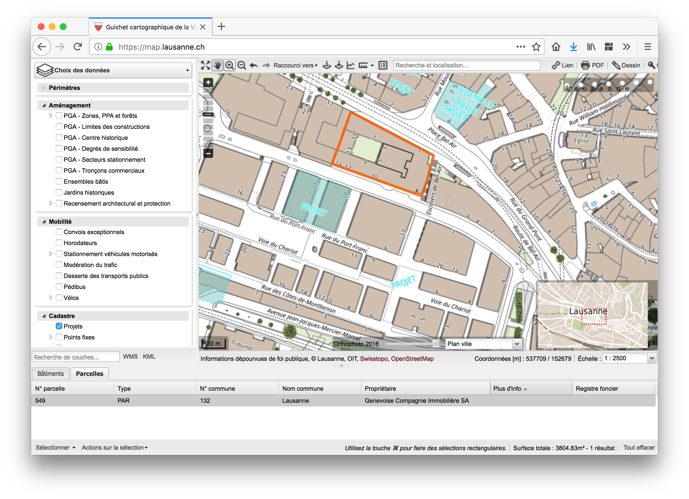

# Who owns Lausanne?

## Abstract
Why are rents in Lausanne so expensive? And who profits from it?

The real estate market is usually quite opaque to the public.
Being ourselves residents of Lausanne, we know how hard finding affordable housing can be. Therefore we would like to know more about the market situation that causes these difficulties.
Our goal is to analyse cadastral data in order to find and visualise the ownership proportions of real estate in the city of Lausanne under different perspectives.

More precisely, by leveraging public-domain data from the administration of both the city of Lausanne and the _canton de Vaud_ we attempt to relate real estate owners and high cost of rents. Furthermore, we try to understand the data from a political point of view. Thereby we hope to improve the transparency of the real estate situation and its effects – _for the good of our society._

## Research questions
 - **Who owns Lausanne?**
  Our title defines the primary aim of this project: getting insights into the ownership of real estate in Lausanne.

 - **What proportion of real estate is possessed by companies,    privates, etc.?**
  In Switzerland there are a particularly high number of privately possessed flats (_ownership of an entire floor_,
  _propriété par étages_ in french). Is this fact visible in the data for Lausanne?
  Or are there many real estate objects possessed by companies?
  We will also try to compare the different proportions to Swiss average values.

 - **What proportion of real estate is possessed by non-swiss entities?**
  This question builds on the previous one. Especially for company owned objects it might be interesting to see whether those companies are based in Switzerland or in other countries.

 - **Who are the richest private real estate owners? How are they involved in local/cantonal politics?**
  Consider for example the _Flon_ in the centre of Lausanne. Most buildings there are indirectly owned by a company called "Mobimo AG". Georges Theiler is a member of their administrative board and at the same time he's active in the liberal democratic party of Switzerland (_PLR_).

## Dataset
Even though our dataset is not listed on the site [opendata.swiss](https://opendata.swiss), we still consider it to be "open swiss data". It comes from official swiss administrations and it is **open to the public**.

The basis for our analysis is the cadastral data which is published by the city of Lausanne on [map.lausanne.ch](https://map.lausanne.ch).
It features information for each parcel including the owner, the area, and the position. The dataset is described on [asitvd.ch](https://www.asitvd.ch/chercher/catalogue.html?view=sheet&guid=486&catalog=main&type=complete&preview=search_list).
Here is an example screenshot and data for the Bel-Air building in the centre of Lausanne:

Additionally, we might want to estimate the real estate surface of the buildings
which is not in the dataset above. However, we can use the data for building
heights extracted from a LIDAR scan of the canton. This dataset is also
described on
[asitvd.ch](https://www.asitvd.ch/chercher/catalogue.html?view=sheet&guid=553&catalog=main&type=complete&preview=search_list).

If we'll need more detailed information on a particular topic (for example rent prices) we will obtain it from [opendata.swiss](https://opendata.swiss). Or we might also aggregate data from real estate portals like [anibis.ch](https://anibis.ch) and [homegate](https://www.homegate.ch/).

Both datasets are available for free for research institutions.
We contacted the _service du secrétariat général et cadastre_ of the city of Lausanne on Friday, 2 November.
They confirmed that the data is available for free for students and gave us the access to their `ftp` server.

We estimate the size of the composite datasets to be of several hundred MB at most.
Therefore, it will comfortably fit into the memory of a single machine.
Regarding the first dataset, the [map.lausanne.ch](https://map.lausanne.ch) API returns `XML` formatted data.
The second dataset is available in several [GIS](https://en.wikipedia.org/wiki/Geographic_information_system) formats, such as MIF/MID (MapInfo), Shapefile, and DXF.

Although our datasets are of geographical nature, we should be able to perform much of the processing without the need of geographical databases.
We can, for example, find the most important real estate owners by simply ranking them by number of parcels owned.
To refine the analysis, however, we might want to include information about the building's surface area and position in our evaluation model. This would require a finer utilisation of geographical data.

## A list of internal milestones up until project milestone 2
 - Week 45: Get the data from the administration and start cleaning.
 - Week 46: Create pipeline and start documentation.
 - Week 47: Finish documentation and get first insights.

**--> 25 November Deadline for milestone 2**

## Questions for TAs
 --> Questions were already discussed during the tutorial session.
